[Введение в программирование машин состояний (ПРИМС) в Arduino]: #
[Авторы курса: Алексей Федосеев aleksey@fedoseev.net и Анита Ходова ]: #
[Текст распространяется под лицензией GNU Free Documentation License (версия 1.3)]: #

# 1. Введение в цифровую электронику и микроконтроллеры

Это занятие открывает модуль, посвященный цифровым устройствам и их управлению с помощью
программирования. Цифровые устройства лежат в основе роботов и беспилотников, умного дома
или умной фермы, медицинских приборов и даже космических аппаратов. Благодаря готовым
контроллерам и визуальному программированию это сделать куда проще, чем может показаться.

## Теоретическая часть

Для знакомства с программированием контроллеров и прохождения модуля онлайн вы можете
познакомиться только с теоретической частью занятия.

### 1.1. Незаметный помощник

Большинство современных людей живет в *необъяснимом мире*. Для них бытовые вещи зачастую
происходят как бы сами собой — телефон заряжается от розетки, робот-пылесос убирает нужную
часть квартиры, чайник останавливается при закипевшей воде, домофон открывается магнитным
ключом. Часто, только уехав из города, человек понимает, что совсем не разбирается, как
это всё работает.

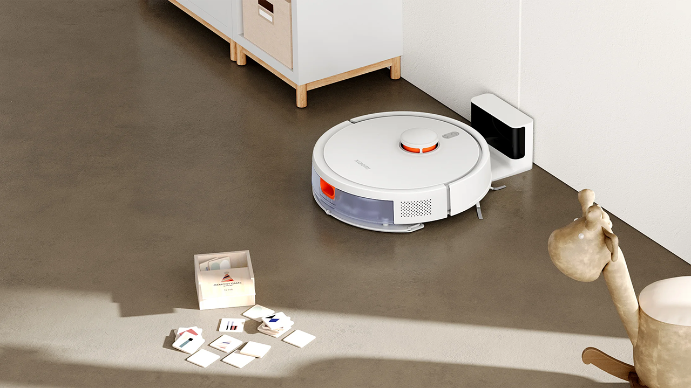

Электроника появилась в XX веке и стала основой всего, что нас окружает — от пожарных
датчиков на потолке до экрана компьютера. Создание электронных приборов и их
программирование позволяет заглянуть «под капот» окружающих умных устройств, перестать
видеть в них магию, и, напротив, опереться на инженерию и понять принципы их работы.

> **Вопрос:** Как думаете, сколько электронных компонентов содержится в обычном смартфоне?
> Предположите примерный порядок числа

Современная электроника очень сложна — в маленьком смартфоне «спрятаны» *тысячи*
электронных компонентов и *миллиарды* логических схем. Если бы телефон собирали из простых
радиодеталей — как первые компьютеры — понадобился бы целый спортивный стадион, чтобы его
вместить.

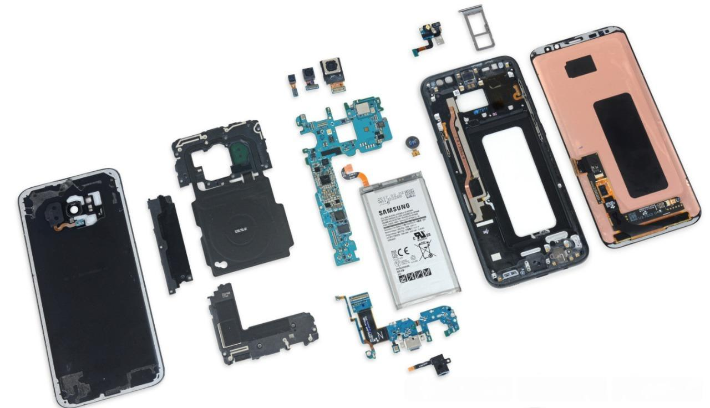

Но понять принципы работы цифровых устройств, их программирования и использования мы
сможем, разбирая простые схемы и примеры. В рамках этого модуля мы научимся делать
незаметное видимым и познакомимся с основами электроники и программирования умных
устройств.

### 1.2. Знакомство с устройством компьютера и микроконтроллера

Современная техника разительно отличается от своих предшественников. Первые компьютеры,
появившиеся в середине XX века, были огромных размеров — они занимали целые комнаты,
весили десятки тонн, а перфокарты для подсчетов менялись машинистками вручную.

В настоящее же время производительные ноутбуки весят около 2-х килограмм, легко
транспортируются и держат автономный заряд батареи до нескольких часов. Подобные перемены
стали возможны благодаря кратному уменьшению компонентов — например, размеры современных
транзисторов меньше, чем клетка гемоглобина в человеческом теле.

[Персональный компьютер — ноутбук](images/notebook.png)

В основе окружающих нас умных систем лежит общий принцип и архитектура, введенная еще в
середине XX века Джоном фон Нейманом: компьютером управляет состоящая из отдельных команд
программа, которая вместе с данными размещается в оперативной памяти, а порты ввода и
вывода обеспечивают не только доступ к долгосрочной памяти или к сети, но и позволяют
управлять любыми внешними устройствами.

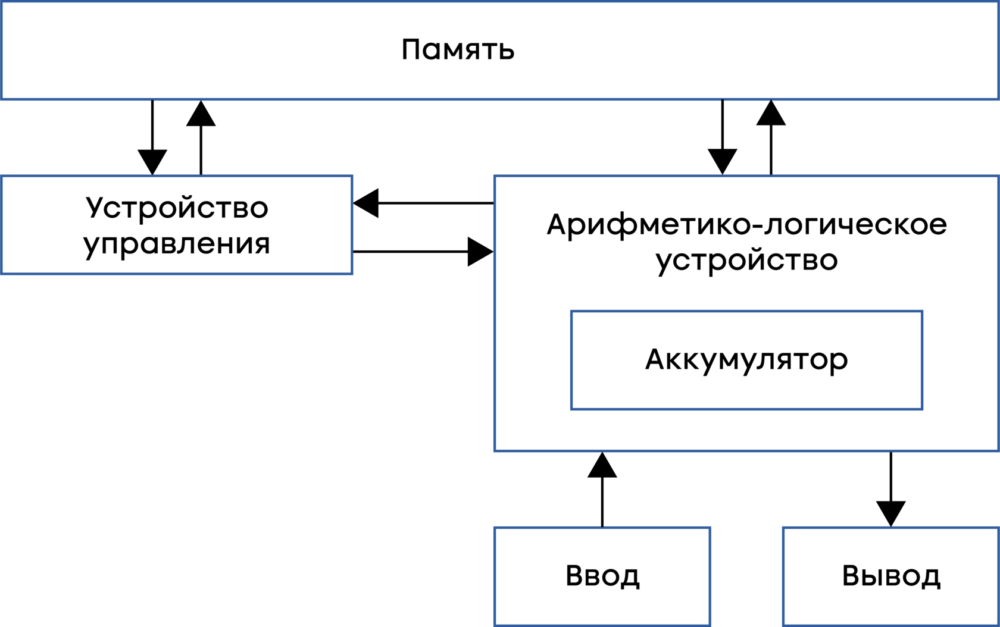

Благодаря достижениям науки и техники такой компьютер умещается в крошечном чипе —
*микроконтроллере*. Микроконтроллеры, как и компьютеры, являются *универсальными*
устройствами управления и используются в более сложных электронных схемах и приборах. Мы
научимся управлять с помощью микроконтроллеров, но перед этим поговорим о том, за счет
чего работают электронные устройства.

### 1.3. Как работает электроника

В основе электроники лежат законы физики и практика электротехники: изменение уровня
напряжения электрического тока в проводе или на дорожке электронной платы является
сигналом к действию для микроконтроллера и программы в нем. Порты ввода и вывода
микроконтроллера управляют сложными системами, представляя изменение напряжения в цепи в
виде цифровых последовательностей из 0 и 1.

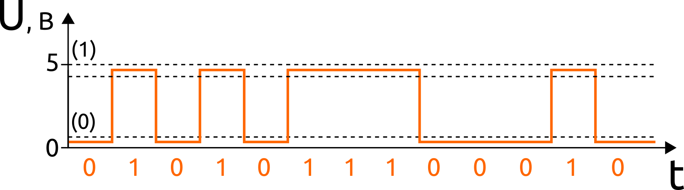

Цифровой сигнал в проводнике связан с определенной *тактовой частотой* — насколько часто
мы можем менять цифровое значение, передавая данные.

Любой контроллер должен чем-то управлять, подавая ток или цифровые сигналы внешним
устройствам. Попробуем разобраться, как устроены электронные схемы, собрав простое
устройство, управляющее светодиодом.

Рассмотрим пример самой простой схемы подключения светодиода к источнику питания на
макетной плате. На рисунке показана простая электрическая схема:

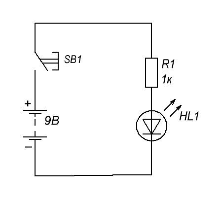

На схеме диод подключен к источнику питания (батарейка «Крона» напряжением 9 В) через
кнопку и резистор (сопротивлением 1 кОм), который необходим для регулирования величины
тока, протекающего через светодиод. Светодиод включается по нажатию кнопки, благодаря чему
ток будет протекать по проводнику.

Чтобы перейти от «ручного» управления светодиодом с помощью нажатия кнопки к более
интеллектуальной работе системы, придется познакомиться ближе с устройством
микроконтроллера и его программированием.

### 1.4. Микроконтроллер Arduino

Появление контроллера (микроконтроллерной платы) Arduino открыло эпоху легкого доступа к
сборке и программированию умных устройств. Arduino — это открытый проект, сочетающий
аппаратное обеспечение (линейка плат, среди которых наиболее распространена Arduino Uno на
базе микроконтроллеров Atmel AVR) и программное обеспечение — среда разработки Arduino IDE
(англ. *Integrated Development Environment* или *IDE*), компиляторы и т.д. Благодаря
открытости плата Arduino оказалась стандартом де-факто для многих простых
микроконтроллеров — как отечественных, так и зарубежных.

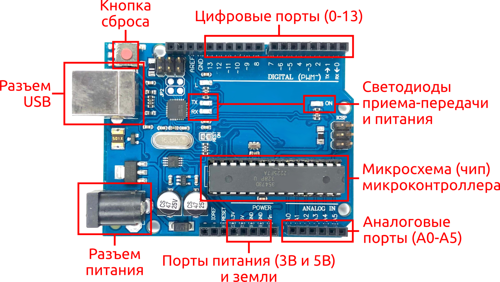

На рисунке показан контроллер, совместимый с Arduino Uno. Плата Arduino помимо чипа
микроконтроллера включает в себя дополнительные контакты (порты) для подключения внешних
устройств, питания или компьютера, служебные светодиоды и кнопку сброса. Это делает плату
универсальной и пригодной для простого подключения к макетной плате для сборки простых
схем без использования пайки.

В рамках модуля мы будем разрабатывать электронные схемы на макетной плате с подключенным
контроллера Arduino и изучать программирование электронных систем.

Чтобы микроконтроллер действительно управлял нашей системой, важно давать ему инструкции
на специальном машинном языке. Подобные языки не допускают двойного прочтения, поэтому
система точно знает, какую работу нужно выполнить. К счастью, современным программистам не
нужно учить машинный язык компьютера, достаточно использовать язык программирования,
который компилируется в исполняемый файл или прошивку, содержащую исполняемую программу в
машинных кодах.

В следующем разделе мы подробнее познакомимся с языками программирования.

### 1.5. Программирование микроконтроллеров на МС

В мире насчитывается свыше 7 000 естественных языков и около 9 000 языков
программирования. Причем, если разнообразие человеческих языков снижается, то количество
языков программирования, наоборот, растет. И хотя для большинства задач используется
только [десять ключевых языков](https://www.tiobe.com/tiobe-index/) — их используют для
научного анализа данных, создания сайтов, поддержки программного обеспечения и др. —
каждый год появляются новые исследовательские и экспериментальные языки.

В рамках данного модуля мы сделаем первые шаги в программировании микроконтроллеров с
помощью **диаграмм машин состояний** (англ. *statecharts*).

Для этого разберем новую задачу про светодиод:

> **Помигать светодиодом**
>
> Изобразите диаграмму машины состояний, в которой светодиод будет периодически мигать:
> загораться, через секунду гаснуть, затем снова загораться и так далее.

Обратите внимание, что в данной задаче светодиод будет включаться и выключаться не при
нажатии кнопки, а по времени — это маленький, но верный шаг в сторону автономной работы
устройства.

Подробнее с языком машин состояний мы познакомимся в следующих модулях. Но на текущем
этапе важно отметить, что это визуальный язык — машины состояний описываются с помощью
**диаграмм**. Чтобы изобразить диаграмму, нужно сперва ответить на несколько вопросов:

1.  Какие режимы работы устройства бывают? Что устройство делает продолжительно?
2.  Когда система переходит от одного режима работы в другой?

Нарисуем для нашей задачи схему, отвечающую на эти вопросы:

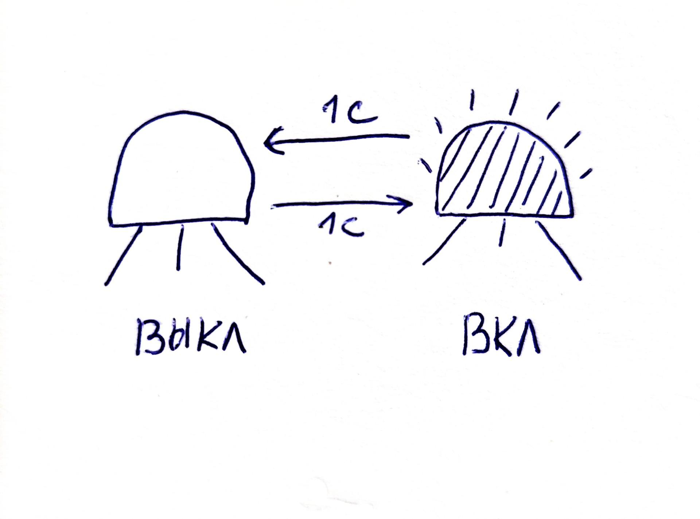

Светодиод работает в двух режимах — когда он выключен и включен, а переход между ними
осуществляется раз в секунду. Теперь нужно привести эту схему к более строгой диаграмме,
которая изображается по определенным правилам:

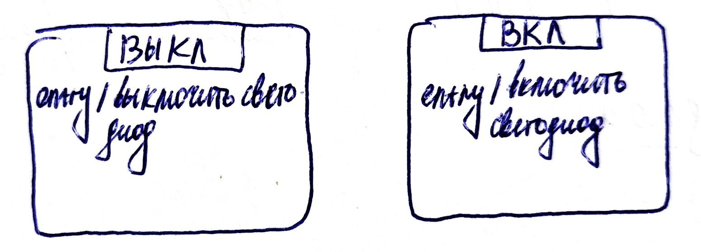

Режимы работы представляются в виде прямоугольников со скругленными краями, а внутри
пишутся команды в формате: «`entry/`» (вход) и «`выключить/включить светодиод`»

> **Вопрос:** Сравните схему и диаграмму — чего не хватает диаграмме, чтобы
> соответствовать условию задачи?

Не хватает условия смены режима — пояснения, в какой момент менять состояние светодиода!
На диаграммах машин состояний мы будем располагать события на стрелочках. Также, мы
добавили на диаграмму Вход — закрашенный кружочек, стрелка от которого поясняет, с какого
режима устройство начинает работу.

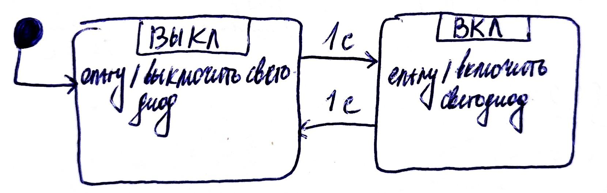

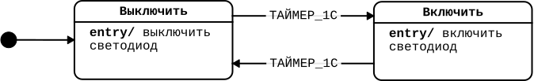

Изображение диаграммы на бумаге помогает запустить процесс мышления и лучше разобраться с
тем, как устроена работа системы. Но важно помнить, что для каждого языка существует своя
среда разработки, где можно редактировать и отлаживать код.

В практическом дополнении модуля мы попробуем перенести данную диаграмму в среду
разработки **Cyberiada IDE** и собрать работающее устройство на макетной плате.

## Практическая часть

Для прохождения практической части вы можете использовать любой из доступных электронных
конструкторов, основанных на контроллере Arduino или воспользоваться самим контроллером и
простыми электронными компонентами. Также вы можете воспользоваться редактором Cyberiada
IDE для того, чтобы научиться работать с диаграммами, а онлайн-симуляторы Arduino можно
использовать для сборки первых электронных схем.

### 1.6. Сборка схемы

Задача для практической части:

> **Помигать светодиодом (практика)**
>
> Напишите программу на языке ПРИМС, в которой светодиод будет мигать: загораться, через
> секунду гаснуть, затем снова загораться и так далее. Проверьте корректную работу
> программы с помощью микроконтроллера Arduino и макетной платы.

Для решения задачи соберем схему, в которой к контроллеру Arduino будет подключен
светодиод с резистором. Для этого нам понадобится:

- микроконтроллер Arduino Uno;
- резистор 220 Ом;
- светодиод;
- провода папа-папа;
- макетная плата.

Перед тем, как собирать схему с контроллером, познакомимся с **макетной платой**, которая
дает возможность легко подключать электронные компоненты друг к другу и к контроллеру и
собирать сложные схемы без использования пайки.

Макетная плата в разрезе представляет собой набор вертикальных и горизонтальных дорожек,
которые связывают шины питания (обычно обозначаемые красными и синими линиями), и
вертикальных дорожек, которые служат для подключения компонентов.

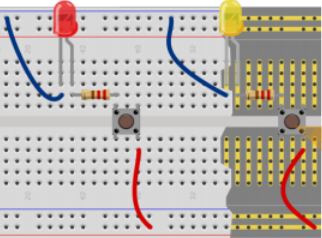

На рисунке показано, как рассмотренная выше простая электрическая схема со светодиодом
может быть собрана на макетной плате с подключенными компонентами. Источник питания
(батарейка) должен быть подключен к шинам питания макетной платы. При подключении
светодиода важно не перепутать выводы — анод (длинный вывод, подключается к **+**) и катод
(короткий вывод, подключается к **-**). Если схема собрана правильно, при нажатии кнопки
светодиод должен загораться.

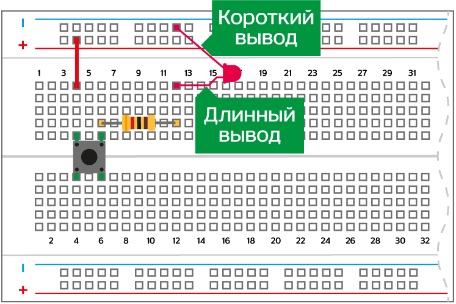

Теперь можно собрать схему, в которой управление светодиодом будет производиться через
контроллер, а не по нажатию кнопки:

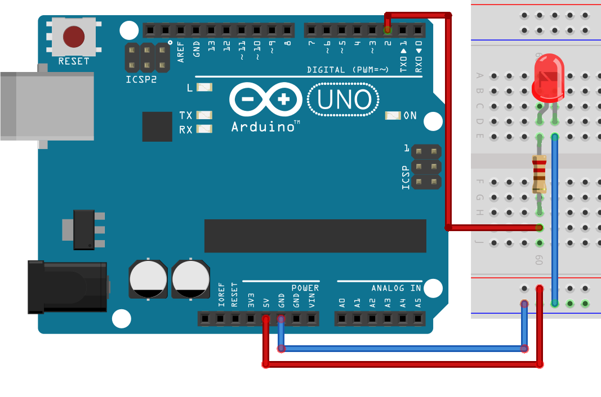

На рисунке показана схема подключения светодиода, расположенного на макетной плате вместе
с резистором номиналом 220 Ом. Обратите внимание на подключение контактов светодиода —
анода к цифровому порту №2 контроллера, а катода к земле. Такое подключение позволит
программно подавать высокое или низкое напряжение на цифровой порт №2, тем самым включить
или выключить светодиод.

Теперь можно переходить к практике программирования контроллера Arduino.

### 1.7. Знакомство с Cyberiada IDE

Cyberiada IDE — это бесплатная отечественная среда разработки с открытым исходными кодом
для программирования умных систем с помощью *машин состояний*. Установить редактор можно,
скачав его по .

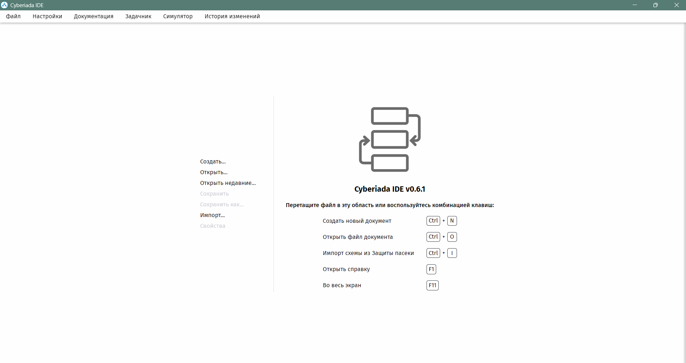

При создании документа необходимо выбрать платформу (так как Cyberiada IDE предназначена
для работы с разными платформами). Нажмите на кнопку «Создать...» и выберите подходящую
вам платформу — Arduino UNO.

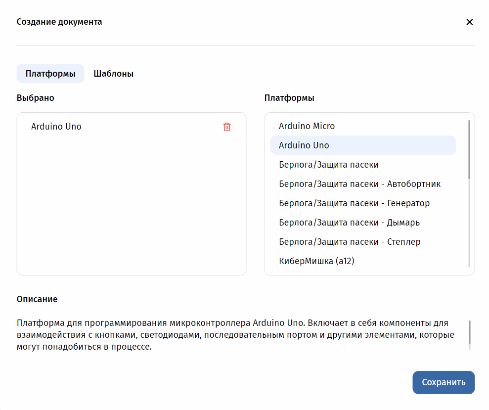

Поэтому для решения задачи нам не понадобится знать специальные команды и модули, которые
в диаграмме будут представлены в виде пиктограмм.

### 1.8. Программирование в Cyberiada IDE

#### Шаг 1. Добавляем компоненты

Сперва необходимо добавить компоненты, которые будут использоваться в будущей программе —
светодиод и таймер. На левой боковой панели щелкните на плюсик рядом с надписью
«Компоненты» и выберите в выпавшем списке «Светодиод». В форме введите удобное название
(например, «Светодиод») и обязательно укажите пин подключения. Аналогично добавьте
компонент «Таймер».

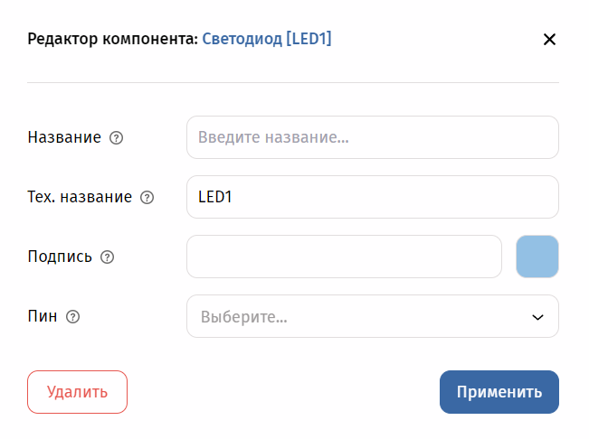

Теперь в левой панели у вас должны отображаться добавленные компоненты

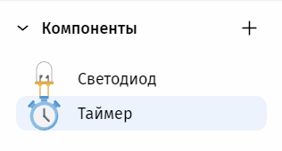

#### Шаг 2. Создаем ключевые состояния

Программа будет включать в себя два состояния (или режима) — когда светодиод не горит и
горит. Для создания первого состояния дважды кликните по свободному месту на экране. Затем
нажмите на иконку с карандашиком в правом углу появившегося состояния и переименуйте
состояние в «`Не горит`».

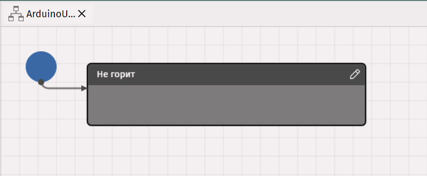

Добавляем действие отключения светодиода: дважды кликните на состояние и нажмите на «+».

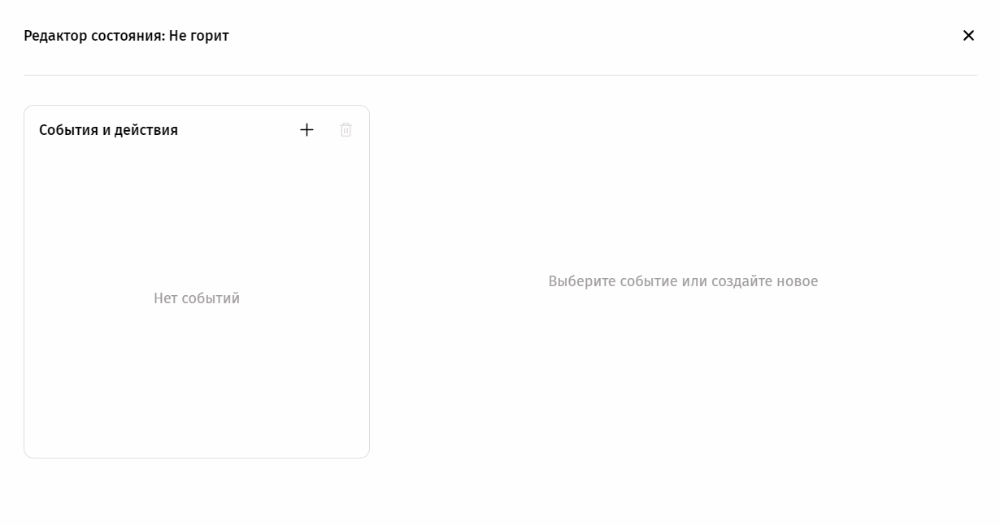

Затем еще раз нажмите на «+» рядом с надписью «Делай». Выберите компонент «Светодиод» и действие «Погасить». В качестве второго действия взведем таймер — компонент «Таймер», действие «Старт», интервал «1000» (измеряется в миллисекундах).

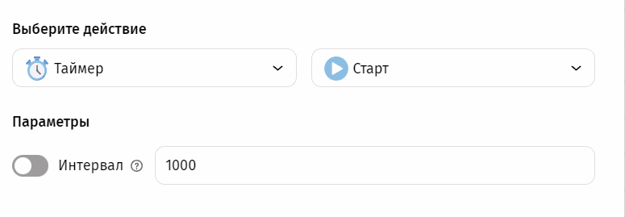

После выбора нужных действий нажмите на кнопки «Сохранить» и «Закрыть».

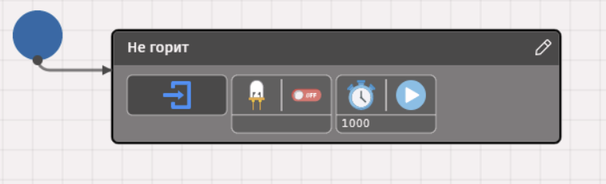

Аналогично создайте состояние «`Горит`» и добавьте туда только команду зажигания
светодиода. Не добавляем дополнительный взвод таймера, так как в Cyberiada IDE таймеры
периодические — можно ввести только один раз, а потом раз в выбранный интервал он будет
срабатывать.

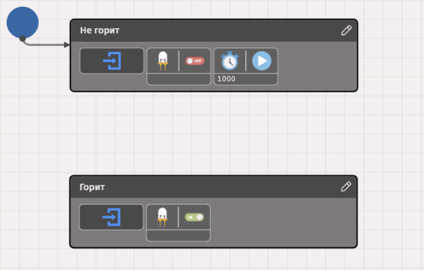

#### Шаг 3. Соединяем состояния переходами

Теперь зададим правила переключения между двумя состояниями — переходы с
событиями. Щелкните на состояние «`Не горит`», потяните за нижний белый плюсик и доведите
стрелку к состоянию «`Горит`». В появившемся окне выберите компонент «Таймер» и событие
«Тайм-аут», добавлять условия и действия НЕ нужно. Нажмите кнопку «Сохранить».

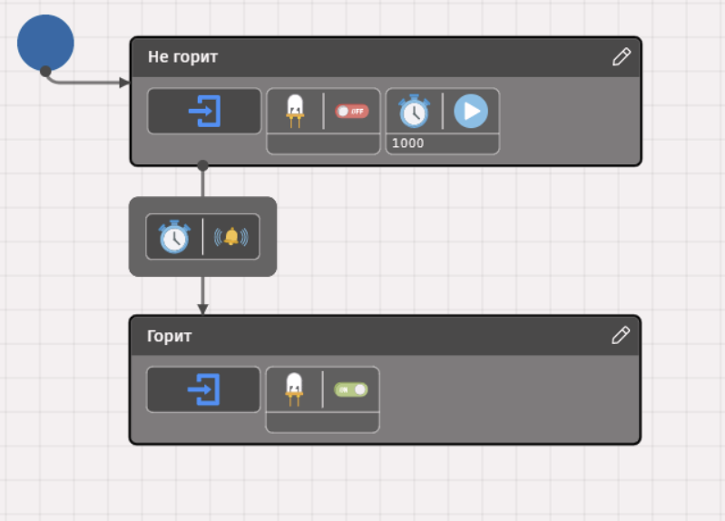

Добавьте такой же переход из состояния «`Горит`» к состоянию «`Не горит`».

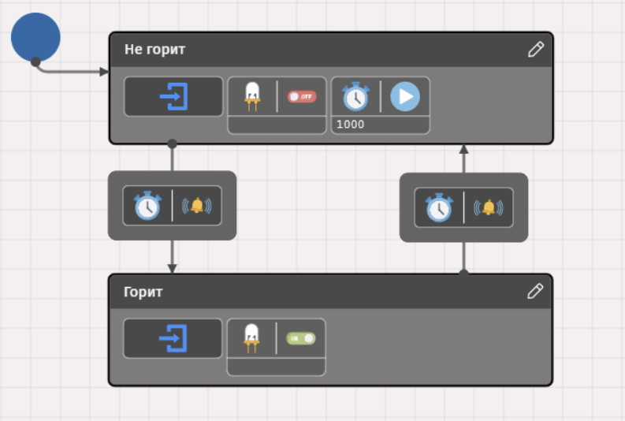

Программа готова! Теперь нужно корректно загрузить ее на Arduino.

#### Шаг 4. Прошивка и тестирование программы

Подключите Arduino к компьютеру и загрузите прошивку через файл программы в редакторе
«Cyberiada IDE»:

1) Откройте раздел «Компилятор» в верхней панели  и
   скомпиллируйте программу:

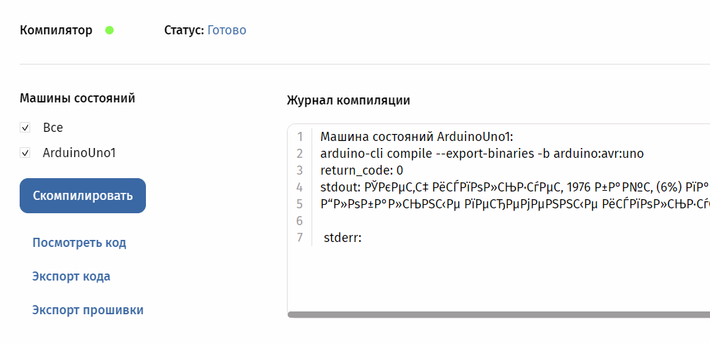

2) Откройте раздел «Загрузчик» в верхней панели 

Параметры загрузчика:

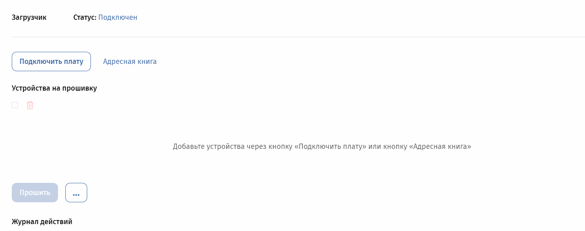

3) Нажмите на кнопку «Подключить плату» и выберите из списка необходимое устройство

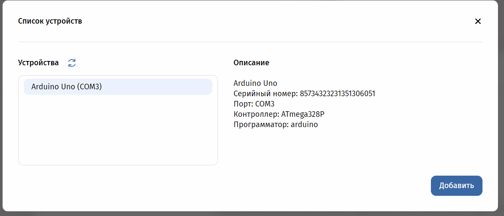

4.  Нажмите на синюю кнопку «Прошить»

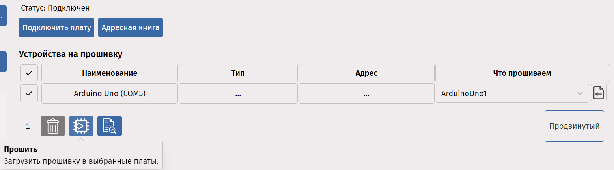

5.  Дождитесь подтверждения прошивки в «Журнале действий»

6.  Проверьте корректность выполнения программы — при первом нажатии кнопки светодиод
    включается, при втором выключается.

## Подведение итогов

На этом занятии мы познакомились с цифровыми устройствами, первыми электронными схемами,
макетной платой и контроллером Arduino, который можно программировать с помощью диаграмм
машин состояний.

На следующих занятиях модуля мы более подробно изучим диаграммы машин состояний для
программирования контроллеров и научимся использовать контроллеры Arduino для создания
самых разных приборов и разрабатывать собственные программы в виде диаграмм машин
состояний.

## Дополнительные материалы по теме

- 
- Модуль 
  онлайн-курса «Программирование автономных систем на примере игры "Берлога: Защита
  пасеки"»
