# 2. Машина состояний для управления светофором на Arduino

Это занятие научит вас общаться с устройствами самым доступным для них способом — с
помощью программы управления. И хотя подходов и языков программирования существует
множество, настоящий программист всегда умеет их отличать и выбирать наиболее подходящий
для каждой конкретной системы.

## Теоретическая часть

Для погружения в программирования контроллера Arduino с использованием машин состояний и
прохождения модуля онлайн вы можете познакомиться только с теоретической частью занятия.

### 2.1. Программы управления

Мы живем в мире сложных систем. Даже по дороге в школу их встречается множество — лифты,
светофоры, уличные фонари, пропускные турникеты. Часто они управляются автоматически, без
участия человека: например, газовые фонари больше не зажигаются вручную — вместо этого
используются датчики освещенности, которые сами включают лампочки ночью. Такой уровень
автоматизации — заслуга программистов, которые разработали для подобных устройств
специальные **программы управления**.

#### Что такое программы управления?

Программа полностью контролирует работу системы. Устройства не умеют думать сами — они
выполняют только те команды и только в той последовательности, в которой они записаны в
программе.

> **Интерактив:** Попробуйте составить инструкцию для робота, которому нужно пожарить
> яичницу из трех яиц.
>
> \- - - - - - - - - - - - - - - - - - -
>
> Рецепты тоже можно рассматривать как *программы управления*. Правда, их пишут для людей,
> а не для роботов. Поэтому если человеку может быть достаточно следующей инструкции:
>
> 1.  Приготовьте ингредиенты: 3 яйца, соль (по вкусу), кусочек сливочного масла.
> 2.  Разогрейте сковороду, смазав ее маслом.
> 3.  Аккуратно влейте яйца и посолите их.
> 4.  Жарьте на среднем огне 2-3 минуты до схватывания белка.
>
> То робот с такой понятной последовательностью действий не справится. Ведь она таит в
> себе множество непонятного:
>
> - Что означает приготовить? Куда приготовить? В чем приготовить?
> - «Соль по вкусу» или «кусочек сливочного масла» — это сколько?
> - Как разогреть сковороду? Где ее смазать маслом?
> - Куда влить яйца? Как это сделать, если они в скорлупе?
> - «Средний огонь» — это какой? Что такое схватывание белка?
>
> У человека, читающего рецепт, есть опыт, который позволяет понять **то, что не прописано
> напрямую** — например, что яйца необходимо *предварительно разбить* и добавить в
> *разогретую на плите* сковородку. А у робота такого опыта нет, поэтому описывать
> действия для него нужно предельно четко. Например, так:
>
> 1.  Положи на кухонный стол 3 яйца. В чайную ложку набери 0,5 грамм соли. В столовую
>     ложку набери 10 грамм сливочного масла.
> 2.  Поставь сковороду на нижнюю правую конфорку электрической плиты. Включи плиту и
>     выстави степень нагрева нижней правой конфорки на «6».
> 3.  С помощью лопаточки покрой тонким слоем сливочного масла всю внутреннюю поверхность
>     сковороды. Засеки таймер на 30 секунд.
> 4.  Разбей 3 яйца в отдельную чашку, отделив скорлупу от белка и желтка. Пустую скорлупу
>     выброси.
> 5.  Когда таймер сработает, перелей яйца из отдельной чашки на скороводу и закрой ее
>     крышкой. Засеки таймер на 2 минуты.
> 6.  Когда таймер сработает, выключи плиту.
>
> Чем более подробной будет ваша инструкция, тем точнее робот сможет выполнить ваше
> задание.
>
> **Вопрос:** А смог бы робот приготовить яичницу по вашей инструкции? Какие доуточнения в
> нее полезно внести?

### 2.2. Ключевые парадигмы программирования

#### Какие бывают парадигмы программирования?

В программировании, как и во многих научных областях, есть свои *парадигмы* — наборы
правил, которые определяют общий взгляд на то, как нужно управлять устройствами и
организовывать код, без привязки к конкретному языку или программе. Можно выделить две
различные **парадигмы**, речь о которых пойдет ниже.

Парадигма, предполагающая строгое выполнение инструкций, называется **императивной** (*от
англ. imperative — «приказ»*). К ней можно отнести рассматриваемое на предыдущем шаге
приготовление яичницы — есть конкретные шаги, которым робот должен четко следовать. Другим
примером может быть стиральная машина, у которой также есть ясный алгоритм: набрать воду →
крутить барабан X минут → слить воду → отжать.

На рисунке представлен пример простого робота-повора из LEGO:

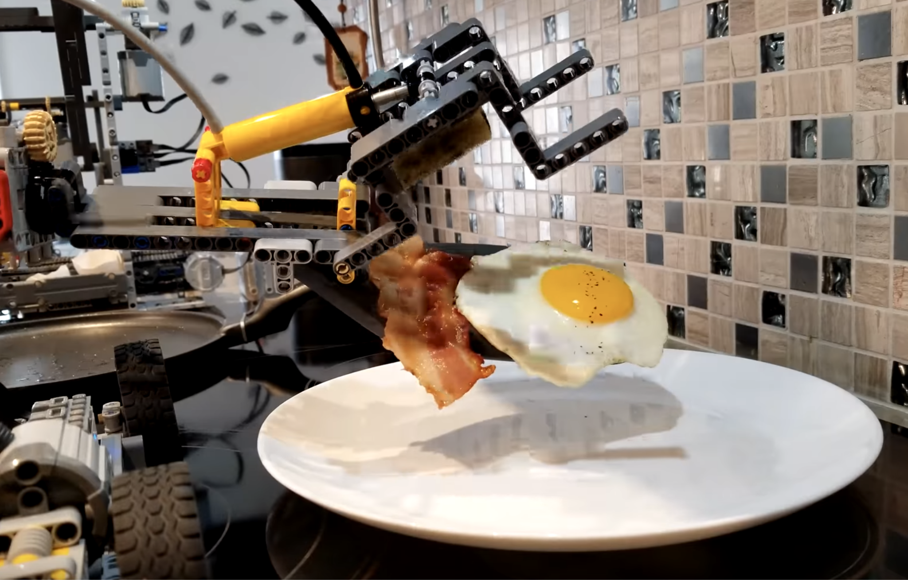

Однако бывают ситуации, когда сформулировать точную инструкцию для устройства
невозможно. Например, когда ученые отправляют космические аппараты на Марс, они многого не
знают: куда именно приземлиться устройство, когда у марсохода разрядиться батарея, какими
будут погодные условия на планете. Из-за этой неопределенности нельзя задать системе
строгую последовательность действий: едь в точку А, возьми образец грунта, вернись на
базу, разверни солнечные панели и включи режим зарядки — это может просто уничтожить
дорогой аппарат, если в этот момент на Марсе идет пылевая буря.

Селфи марсохода «Curiosity»:

Подобные ситуации неопределенности нередко встречаются и на Земле: достаточно взглянуть на
лифт в многоэтажном доме. Его работа тоже не поддается строгому описанию, ведь мы точно не
знаем, на какой этаж лифт вызовут в следующий раз, куда отправятся и будут ли по дороге
параллельные вызовы от других жильцов. **Как же программировать подобные устройства?**

Для таких сложных систем отлично подходит **событийное программирование**. Эта парадигма
предполагает, что мы не даем четкой инструкции, а задаем общие правила, чтобы система
могла сама переключаться в нужный режим работы в зависимости от внешних
факторов. Например, если при приземлении у марсохода обнаружится низкий заряд батареи, то
он не станет заниматься сбором грунта, а сразу развернет панели для получения энергии. И
это не гипотетическая ситуация, а [реальный
кейс](https://embeddedonlineconference.com/session/Mars_Perseverance_Software).

Таким образом, императивный подход удобен для программ, которые реализуют конкретные
известные шаги, а событийный — для управления автономными системами в слабо определенном
окружении, например в ситуации взаимодействия с человеком или другими автономными
системами. В рамках этого модуля, мы познакомимся подробнее с более гибкой — событийной —
парадигмой программирования.

> **Вопрос:** А можно ли одно устройство запрограммировать и в событийной логике, и в
> императивной? Если да, то какое и почему?

### 2.3. Машины состояний

#### Что такое машины состояний?

Одна из распространенных реализаций событийной парадигмы — это машины состояний. Само
название уже раскрывает логику этого подхода — мы задаем машине (устройству или системе)
**состояния**, в которых она может находиться и между которыми может *переключаться*. Это
означает, что в работе системы нужно выделить *особые режимы работы*, в каждом из которых
реализуются уникальные, не повторяющиеся в других режимах действия. Например, для готовки
яичницы можно выделить два больших состояния — «Подготовка» и «Жарка». В первое будут
включены все действия по подготовке ингредиентов и посуды, а во второе — сам процесс
приготовления яиц.

Рассмотрим еще один пример — программа микроволновки с грилем, представленная как машина состояний:

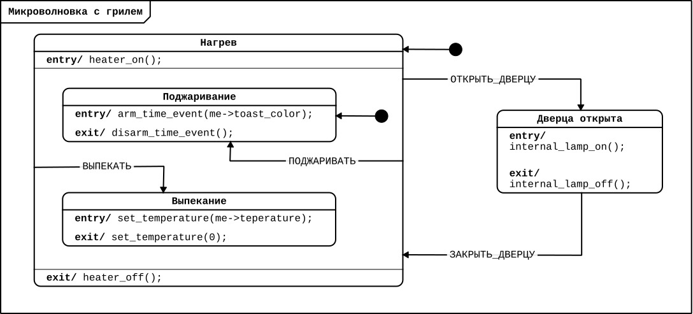

> **Вопрос:** Не кажется ли вам необычным, как здесь представлена программа? Что
> непривычного вы видите?

Машины состояний описываются с помощью **диаграмм**. Это визуальный способ представления
программы, где каждый элемент имеет свое значение:

| **Элемент** | **Как выглядит в программе?** | **Пример в программе** | **Особенности** |
|----|----|----|----|
| Состояния | Прямоугольники со скругленными краями | «`нагрев`», «`поджаривание`», «`выпекание`», «`дверца_открыта`» | Состояния имеют имена, которые обозначают поведение системы в этом состоянии. Каждая машина состояний имеет начальное состояние — то, в котором процесс исполнения машины состояний начинается. Начальное состояние отмечается стрелкой, исходящей из закрашенного кружка. |
| События | Располагаются на стрелках-переходах между состояниями | «`ОТКРЫТЬ_ДВЕРЦУ`», «`ЗАКРЫТЬ_ДВЕРЦУ`», «`ПОДЖАРИВАТЬ`», «`ВЫПЕКАТЬ`» | Изменение в системе и окружающем ее мире, значимое для программы управления. Есть *внешние события* — те, которые приводят к смене состояний. Направление стрелки показывает ИЗ какого В какое состояние осуществляется переключение. |
| Действия | Указываются внутри состояний после служебных слов `entry/` и `exit/` (вход и выход) | «`heater_on()`» \[включить печь\], «`set_temperature(0)`» \[выставить температуру 0°\], `«internal_lamp_off()`» \[выключить лампу\] | В диаграммах состояний чаще всего мы встречаемся с действиями на входе и на выходе из состояния. |

Теперь, глядя на диаграмму свежим взглядом, восстановим работу микроволновки
целиком. Начальным состоянием будет «`нагрев`», сразу после входа в которое машина
состояний перейдет в состояние «`поджаривание`». Если дверца будет открыта и произойдет
соответствующее событие, нагреватель будет отключен в целях безопасности.

Обратите внимание, что состояния «`поджаривание`» и «`выпекание`» находятся внутри
состояния «`нагрев`», что называется **иерархией состояний**. Это значит, что «`нагрев`»
является родительским состоянием, а «`поджаривание`» и «`выпекание`» — его дочерними
состояниями.

### 2.4. Программирование светофора

Чтобы лучше разобраться с особенностями построения диаграмм, давайте решим следующую
задачу:

> **Светофор**
>
> Изобразите диаграмму машины состояний для светофора, который днем поочередно
> переключается между красным, желтым и зеленым сигналом, а ночью мигает желтым светом.

Предлагаем вам сперва попробовать решить задачу самостоятельно, и лишь затем знакомиться с
предложенным нами решением.

Рекомендуем сперва рисовать диаграммы на бумаге или на доске, прежде чем использовать
визуальные редакторы или среды разработки.

Все решения несовершенны, и научно доказано, что учиться на своих ошибках полезно :)

#### Шаг 1. Устройство системы

Как уже обсуждалось в предыдущем модуле, первым делом необходимо изобразить на схеме, как
должна быть устроена программируемая система.

В нашем случае условие задачи и есть описание необходимой работы светофора. Есть дневной
режим работы, где будут последовательно загораться «красный — желтый — зеленый»
светодиод. Есть ночной режим, где раз в секунду желтый светодиод то включается, то
выключается. Переход между ними осуществляет при смене времени суток.

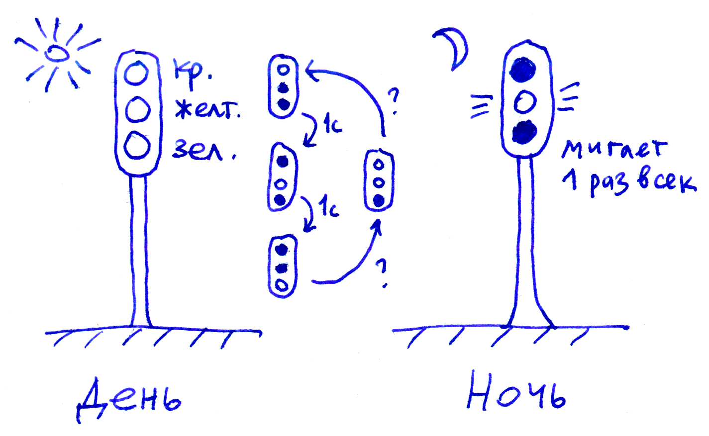

#### Шаг 2. Диаграмма МС

Из описания системы можно выделить два больших состояния — «`День`» и «`Ночь`». Состояние
«`День`» делится еще на три состояния по цветам светодиодов — «`Горит красный`», «`Горит
желтый`» и «`Горит зеленый`». Наиболее простым событием, реализующим смену дня и ночи,
может быть нажатие кнопки. Изобразив все это на бумаге, получаем следующую диаграмму:

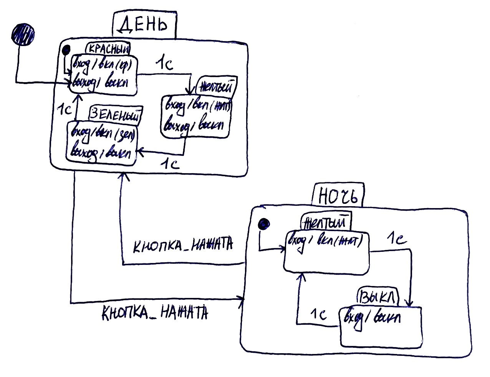

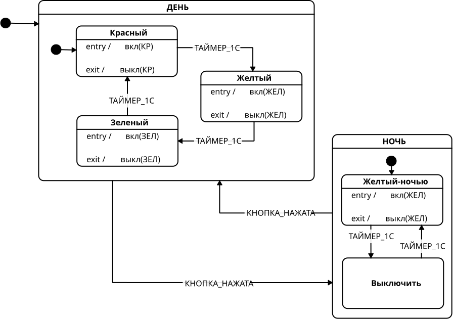

В практической части реализуем программу светофора на макетной плате.

### 2.5. Иерархия состояний

Иерархия встречается во многих сферах — от поведения стайных животных до карьерной
лестницы на работе, от управления школой до управления государством, от доменных имен
сайтов до организации файловой системы компьютера. Но где бы мы не встречали иерархию, это
всегда особый порядок отношений элементов системы, при котором **низшие уровни подчиняются
высшим**.

Для машин состояний иерархия играет важную роль — она позволяет реализовывать **обобщенное
поведение**. Например, это возможность перейти в состояние «`Ночь`» по событию
«`кнопка_нажата`» вне зависимости от того, в каком из дочерних состояний «`День`» —
«`Красный`», «`Желтый`» или «`Зеленый`» — находилась программа до этого. Если бы мы решили
нарисовать диаграмму без использования иерархии, нам бы пришлось от каждого из дневных
состояний проводить дополнительный переход, что значительно загромоздило бы диаграмму:

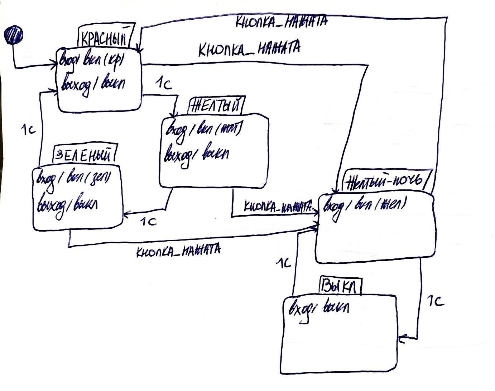

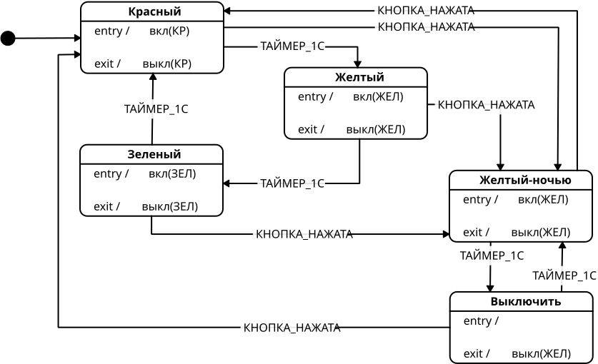

А в более сложных программах, где количество состояний кратно больше, без иерархии совсем
не получилось бы корректно реализовать программу. Таким образом иерархия позволяет
уменьшить число стрелок-переходов на диаграмме, сделать ее более читаемой и лаконичной.

На рисунке показана грамотно реализованная иерархия в диаграмме МС собаки на прогулке:

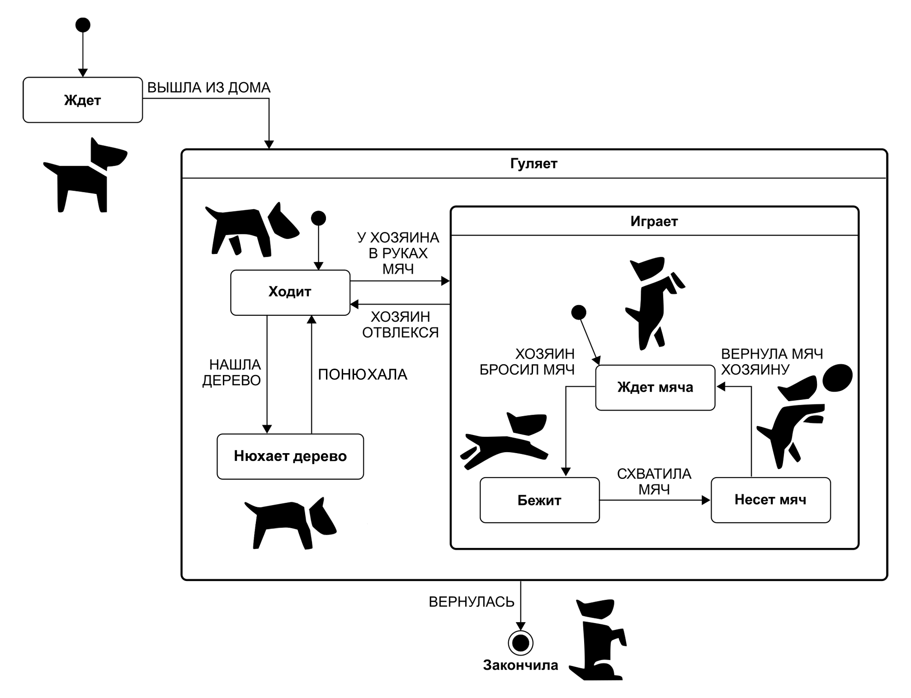

## Практическая часть

Для прохождения практической части вы можете использовать любой из доступных электронных
конструкторов, основанных на контроллере Arduino или воспользоваться самим контроллером и
простыми электронными компонентами. Также вы можете воспользоваться редактором Cyberiada
IDE для того, чтобы научиться работать с диаграммами, а онлайн-симуляторы Arduino можно
использовать для сборки электронных схем.

### 2.6. Сборка схемы

Задача для практической части:

> **Светофор на Arduino**
>
> Напишите программу для светофора, который днем поочередно переключается между красным, желтым и зеленым сигналом, а ночью мигает желтым светом. Затем соберите такой светофор на базе микроконтроллера Arduino.

Сперва соберем схему на макетной плате. Для этого нам понадобится:

- микроконтроллер Arduino Uno;
- тактовая кнопка — 1 штука;
- резисторы около 220 Ом (180-300) — 3 штуки;
- резистор около 10 кОм — 1 штука;
- светодиоды — 3 штуки (1 красный, 1 жёлтый, 1 зелёный);
- провода папа-папа – 11 штук;
- макетная плата – 1 штука.

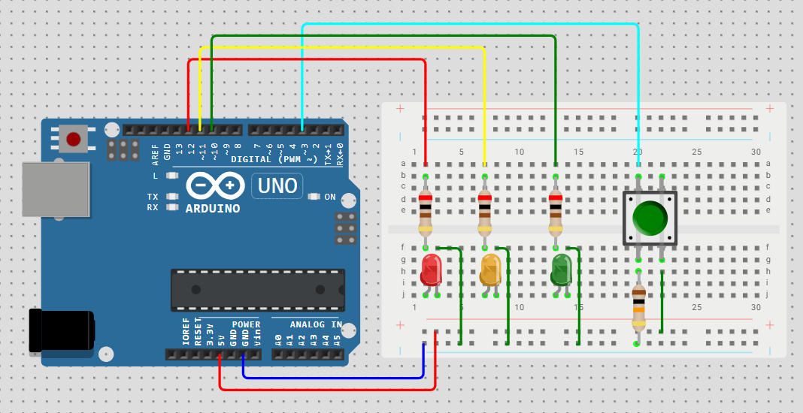

### 2.7. Перенос диаграммы в редактор «Cyberiada IDE»

Момент переноса промежуточной диаграммы с бумаги в редактор — отличная возможность ее
переосмыслить. Понаблюдав внимательнее за работой настоящего светофора, стало заметно, что
нами не было выделено еще одно важное состояние — одновременное зажигание красного и
желтого сигнала. Добавим его в цифровую диаграмму.

Откройте редактор «Cyberiada IDE» и создайте новый файл на платформе «Arduino
Uno». Добавьте в программу необходимые компоненты:

- Таймер
- Красный светодиод (не забудьте выбрать пин, к которому будет подключен светодиод)
- Желтый светодиод (не забудьте выбрать пин, к которому будет подключен светодиод)
- Зеленый светодиод (не забудьте выбрать пин, к которому будет подключен светодиод)
- Кнопка (не забудьте выбрать пин, к которому будет подключена кнопка, и подтяжку — к земле)
- Счетчик

Затем создайте следующую программу работы:

| **Состояние** | **Пояснение** |
|----|:---|
| «Дневной режим» | Если кнопка не была нажата, светофор переходит в состояние «`Дневной режим`», где осуществляется поочередное переключение между следующими дочерними состояниями: • зажигание красного светодиода • зажигание желтого светодиода • зажигание зеленого светодиода • зажигание желтого и красного светодиодов |

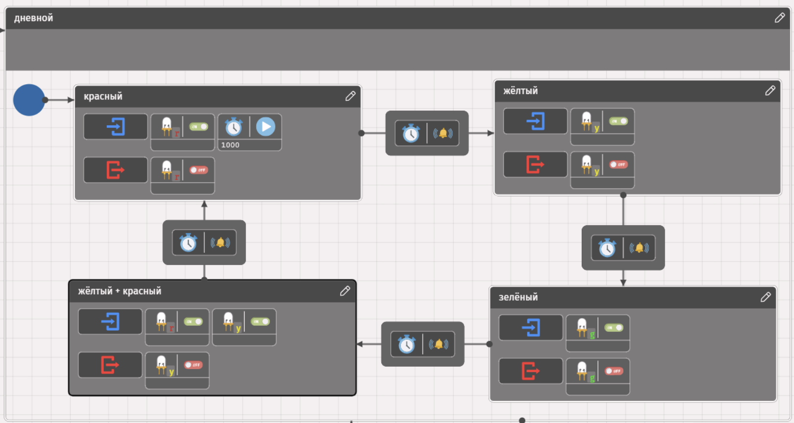

*Дневной режим*

| **Состояние** | **Пояснение** |
|----|----|
| «Ночной режим» | Если кнопка была нажата, то переходим в состояние «`Ночной режим`», где есть два дочерних состояния: • зажигание желтого светодиода • выключение светодиода Переход между ними происходит по событию «`Таймер.Тайм-аут`». Обратите внимание, что подобную программу мы уже собирали в предыдущем модуле. |

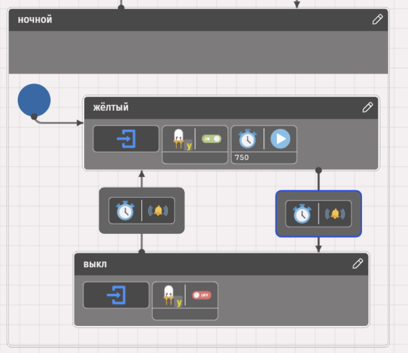

*Ночной режим*

Полная программа будет выглядеть следующим образом:

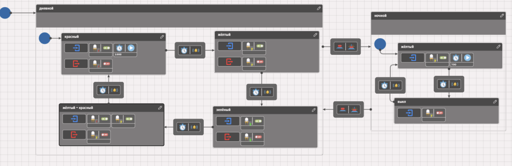

Проверьте, корректно ли работает программа: раз в секунду переключается светодиод
(красный—желтый—зеленый—желтый ), а при нажатии на кнопку реализуется переход к ночному
режиму с миганием желтого светодиода.

## Подведение итогов

На этом занятии мы познакомились с двумя парадигмами программирования — императивной
(команды заданы в строгой последовательности) и событийной (заданы все возможные состояния
и правила переходов между ними). А также, погрузились в изучение машин состояний — язык,
который станет нашим основным и для дальнейших модулей, и для решения задач на олимпиаде.

Следующее занятие будет посвящено более глубокому погружению в язык ПРИМС для
программирования умных устройств с использованием машин состояния и событийной парадигмы
программирования.

## Дополнительные материалы

-  //
  Альманах киберфизики: Выпуск 1, 2024 год / Ред.: А. И. Федосеев, О. Е. Кускова — М.:
  Ассоциация участников технологических кружков, Национальная киберфизическая платформа,
  2025.
-  (2025-2026 учебный
  год);
- 
  онлайн-курса «Программирование автономных систем на примере игры "Берлога: Защита
  пасеки"»;
- 
  онлайн-курса «Программирование автономных систем на примере игры "Берлога: Защита
  пасеки"».
