# 3. Основы программирования машин состояний: состояния и события в программе

На предыдущих занятиях мы знакомились с машинами состояний интуитивно — через интерфейс
редактора и бытовые примеры. Однако, чтобы создавать по-настоящему сложные и интересные
программы, важно понимать основы языка. Именно такому, более содержательному, знакомству
будет посвящено данное занятие.

## Теоретическая часть

Для погружения в программирование машин состояний и прохождения модуля онлайн вы можете
познакомиться только с теоретической частью занятия.

### 3.1. Особенности ПРИМС

#### Кто придумал программировать машины состояний?

Конечные автоматы и машины состояний — это основа компьютерных наук. Еще в середине XX
века британский математик Алан Тьюринг сформулировал концепцию идеальной машины,
получившей впоследствие название *«машины Тьюринга»*, с помощью которой можно было
провести любое вычисление. Такая машина представляет собой набор состояний и правил
переходов между ними под управлением поступающего на вход набора символов. Эта концепция
легла в основание первых компьютеров, о которых мы вспоминали на первом занятии.

Любой центральный процессор или контроллер представляет собой огромную и очень сложную
машину состояний, которая управляется машинными кодами — каждый шаг в программе изменяет
внутреннее состояние контроллера и/или памяти компьютера. Нет ничего удивительного, что
концепция машин состояний (Statecharts или State Machines) стала широко применяться при
создании программ, в том числе даже при описании поведения персонажей в видеоиграх!

Наиболее заметно применение машин состояний при проектировании сложных систем. В
международном стандарте визуальных диаграмм для проектирования ПО — Unified Modeling
Language (UML) — целая глава посвящена машинам состояния как визуальному языку описания
поведения сложных систем. В русском языке мы предлагаем использовать аббревиатуру
«**ПРИМС**», которая расшифровывается как **П**рограммирование **Р**асширенных
**И**ерархических **М**ашин **С**остояний.

ПРИМС — индустриальный язык, как и UML. Благодаря глубокой работе
[зарубежных](https://www.state-machine.com/) и
[отечественных](https://platform.kruzhok.org/programming) разработчиков ПРИМС используют
для программирования совершенно разных устройств — от марсоходов и стиральных машин до
[видеоигр](https://games.kruzhok.org/courses/1). C 2024 года в России были приняты
национальные стандарты, посвященные программированию машин состояний — [ПНСТ
984-2024](https://docs.cntd.ru/document/1310904414) и [ПНСТ
1044-2025](https://docs.cntd.ru/document/1315271883).

#### Каковы ключевые элементы ПРИМС?

> **Вопрос:** Вспомните диаграммы машин состояний из предыдущих модулей. Из каких
> элементов они состояли?

В языке ПРИМС можно выделить три ключевых элемента — состояния, события и действия. Они
встречаются в *каждой* программе вне зависимости от того, что вы программируете: дверь с
домофоном, персонажа игры или лифт. Можно сравнить эти элементы с кухонной посудой — они
имеют определенную функцию и внешний вид, но каждый программист наполняет их своими
ингредиентами. Познакомимся подробнее с каждым элементом.

### 3.2. Состояния

Самый первый элемент, который мы изучим, — это **состояние**. Машина состояний — это, по
сути, множество возможных состояний и правила перехода между ними.

Состояние — это режим работы системы, в котором совершаются какие-то определенные
действия. Мы часто сталкиваемся с состояниями у окружающих нас приборов: режимы работы
есть у микроволновки и мультиварки, а ноутбук может переходить в спящий режим. Важно
отметить, что состояние — это *продолжительный* комплексный процесс (например, поиск или
сближение), а не отдельная команда (активируй сканер или едь в точку А).

В диаграммах состояния изображаются в виде **прямоугольников со скругленными или
скошенными краями** и **обязательно именуются**. Имя всегда должно четко отражать процесс,
который реализуется в рамках этого состояния.

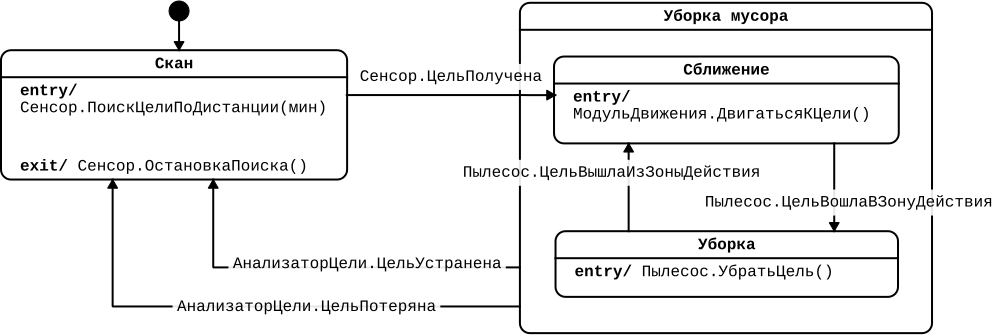

> **Вопрос:** Внимательно рассмотрите диаграмму работы робота-пылесоса и назовите все
> состояния, которые есть в программе.

В представленной программе есть четыре состояния — «`Поиск мусора`», «`Уборка мусора`»,
«`Сближение`» и «`Уборка`». Причем, представлена еще и иерархия состояний — «`Уборка
мусора`» содержит два дочерних состояния — «`Сближение`» и «`Уборка`».

Восстановим работу робота-пылесоса целиком. Программа начинается с состояния «`Поиск
мусора`», где робот активирует сенсор и ищет ближайший к себе мусор. Когда мусор найден
(событие «`Сенсор.ЦельПолучена`»), реализуется переход в состояние «`Сближение`», в
котором осуществляется движение к обнаруженной цели. Как только робот достигает мусора на
расстоянии, где может его собрать, выбрасывается событие
«`Пылесос.ЦельВошлаВЗонуДействия`» и происходит переход в состояние «`Уборка`», где мусор
убирается. Как только мусор убран, программа возвращается в начальное положение.

Обратите внимание, что робот всегда находится в единственном и определенном состоянии. Это
одно из наиболее важных правил языка машин состояний: **в каждый момент времени система
находится только в одном состоянии.**

> **Интерактив:** Посмотрите [отрывок из мультфильма «Ну,
> погоди!»](https://disk.360.yandex.ru/i/FxUp524Nxu9-9g) и выпишите все состояния, в
> которых находился красный робот Зайца.
>
> В поведении робота можно выделить четыре ключевых состояния:
>
> - «`Ожидание`» — пока Заяц не открыл коробку, робот ничего не делал. Это очень
>   распространенное состояние во многих бытовых устройствах — ждать начала
>   взаимодействия.
> - «`Передача управления`» — короткое состояние, в котором робот передал Заяцу пульт
>   управления.
> - «`Танцы`» — в это состояние робот переходил дважды: при первичном нажатии кнопки
>   Зайцем и после победы над роботом Волка.
> - «`Борьба`» — состояние сражения на мечах с Волком и его роботом.
>
> Если изобразить их в виде диаграммы, получится следующая программа:
>
> 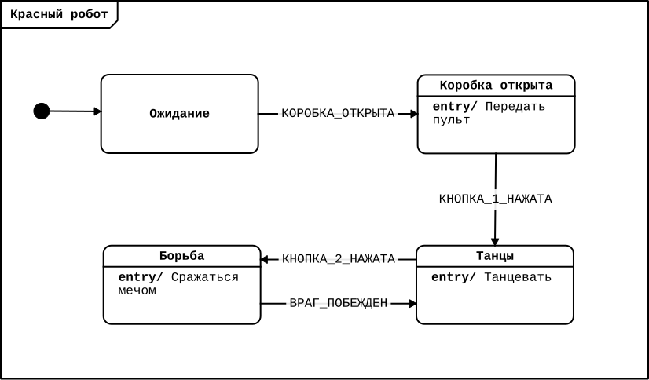
>
> Обратите внимание, что состояние «`Ожидание`» пустое, в нем ничего не происходит —
> добавлять команды не обязательно. А вот в других состояниях, при желании, можно
> расписать команды подробнее — например, команду «`танцевать`» разделить на «`прыжок
> влево`» и «`прыжок влево`». Однако тут важно отметить, что это именно отдельные команды,
> выделять их в отдельные состояния неосмысленно, поскольку это однократные действия, а не
> процесс.

### 3.3. События

Вторым по значимости элементом диаграмм машин состояний является **событие**. Если
состояния обозначают режимы работы дрона, то события связаны со сменой режимов
работы. Отсюда название данного подхода программирования — событийное

События — это изменения в системе и окружающем ее мире, значимое для программы
управления. Они задают динамику программы и позволяют отразить в программе сложное
поведение автономной системы в заранее неизвестном окружении. Часто имена событий
сформулированы как совершенное действие — например «`цель потеряна`», «`таймер истек`»,
«`дверца открыта`» и т. д.

Важно, что из одного состояния не могут выходить два одинаковых перехода с одним и тем же
событием, иначе машина состояний окажется в неопределенном состоянии.

Различим события двух видов — **внешние** и **внутренние**.

#### Внешние события

Внешние события изображаются на стрелках-переходах и *приводят к смене
состояний*. Направление стрелки показывает *из* какого *в* какое состояние программе
переходит при возникновении данного события.

Для примера вновь обратимся к диаграмме работы робота-пылесоса. Все события в данной
программе являются внешними — располагаются на стрелках и приводят к смене
состояний. Например, событие «`Сенсор.ЦельПолучена`» приводит к смене состояния «`Поиск
мусора`» на состояние «`Сближение`».

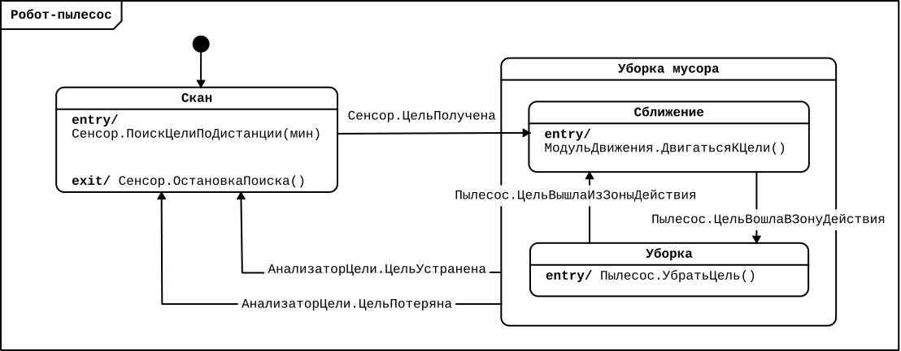

#### Внутренние события

В свою очередь, внутренние события позволяют осуществлять новые действия без смены
текущего состояния. Например, когда необходимо поменять цвет лампочки в умном светильнике,
неудобно создавать отдельное состояние. Разумно поместить смену цвета в состояние
«`Включено`» через внутреннее событие «`ТумблерЦветаИзменен`».

Пример умной лампочки:

Управление умной лампочки может выглядеть так:

Диаграмма для умной лампочки:

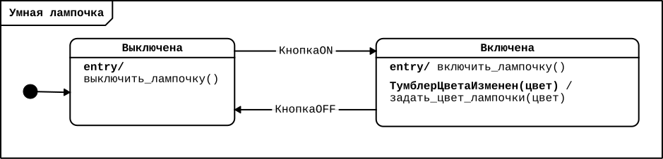

Как видно на диаграмме, внутренние события обозначаются на диаграмме внутри прямоугольника
состояния, рядом с действиями входа и выхода. В текстовом варианте диаграммы внутренние
события обозначаются именем и символом косой черты (`/`), возможные аргументы события
указываются в скобках.

> **Интерактив:**
>
> 1.  Посмотрите на диаграмму и предположите, какие события должны быть на переходах:
>
> 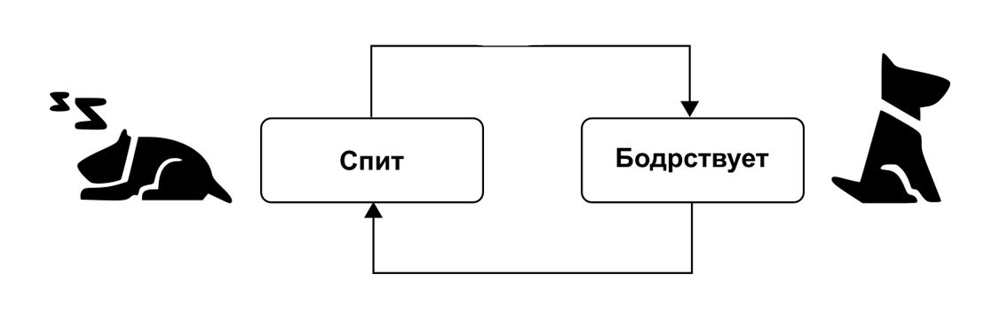
>
> Наиболее логичными событиями, связывающими состояния сна и бодрствования, являются
> «`Проснулась`» и «`Заснула`».
>
> 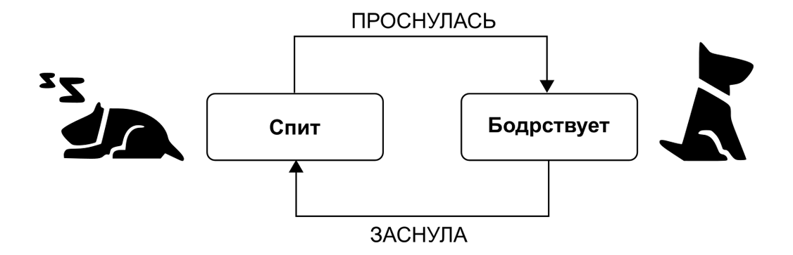
>
> Ваши формулировки могут немного отличаться. Главное проверьте, чтобы ваши события:
>
> - подходили по смыслу (действительно ли по этому событию можно перейти в нужное состояние)
> - были сформулированы как совершенные действия (отвечали на вопрос «Что сделано?»)
>
> 2.  Посмотрите на диаграмму выгула собаки. Допишите, каких *внешних* событий не хватает на переходах. Предположите, какие *внутренние* события могли бы быть внутри состояния «`Гуляет`» и какие действия они за собой повлекли бы.
>
> 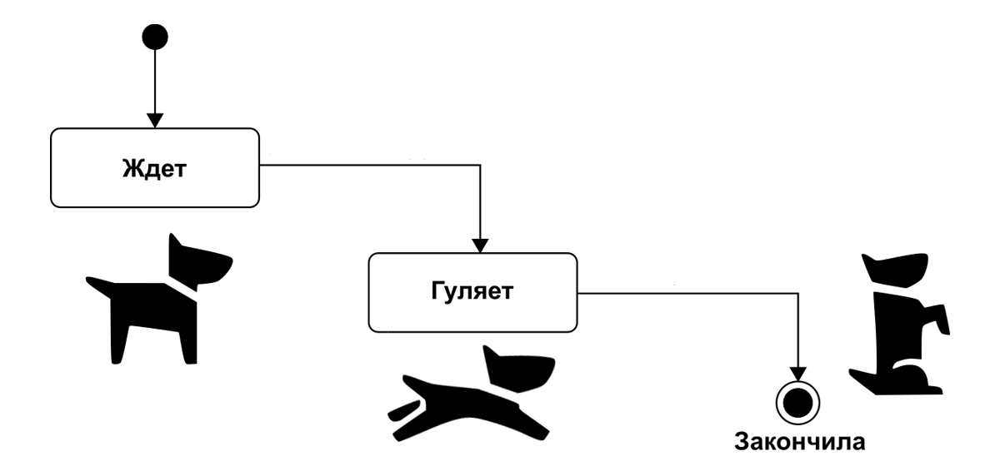
>
> Переходы между событиями явно связаны с перемещением в пространстве, поэтому внешние события могут быть следующими:
>
> 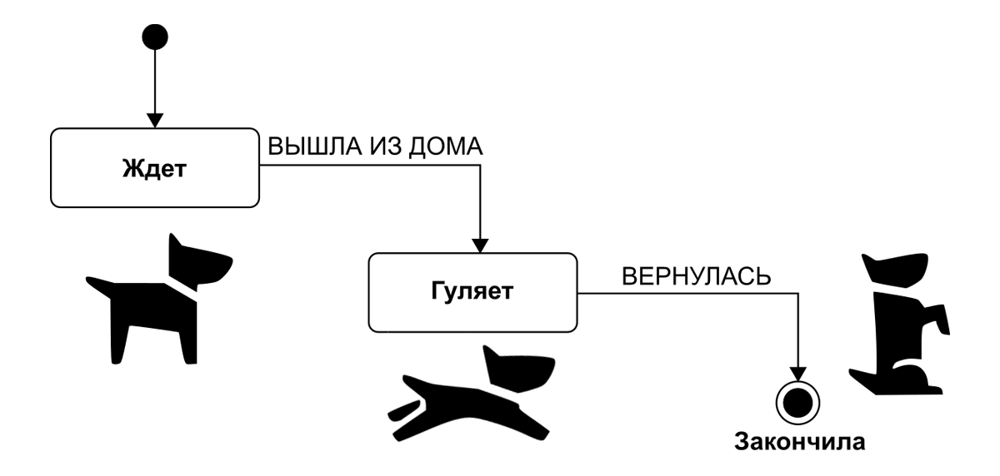
>
> Внутренние же состояния скорее всего будут связаны с объектами и действиями,
> встретившимися собаке на улице — главное, чтобы эти события не меняли сути состояния
> прогулки. Примером таких событий могут быть:
>
> - «`обнаружено_дерево`» — понюхать его;
> - «`хозяин_достал_лакомство`» — выполнить команду;
> - «`хозяин_бросил_мяч`» — вернуть мяч;
> - «`обнаружена_другая_собака`» — поиграть с ней;
> - и т.д.

### 3.4. Программирование системы светофоров

Для закрепления знаний о состояниях и событиях решим усложненную задачу про светофоры:

> **Система светофоров на перекрестке**
>
> Изобразите диаграмму машины состояний для системы на перекрестке, состоящей из
> автомобильного светофора и пешеходного светофора. Когда пешеходов нет, для машин всегда
> горит зеленый. Если пешеход нажал на кнопку, то его светофор зажигается зеленым, а
> машины должны остановиться.

Предлагаем вам сперва попробовать решить задачу самостоятельно, и лишь затем знакомиться с
предложенным нами решением.

Рекомендуем сперва рисовать диаграммы на бумаге или на доске, прежде чем использовать
визуальные редакторы или среды разработки.

У такой системы светофоров можно выделить три режима работы: 1) когда пешеходов нет; 2)
когда пешеход подошел и ждет; 3) когда пешеход может переходить улицу. Поскольку мы
координируем работу двух светофоров, важнее всего понять, каким цветом в каждый момент
времени они горят.

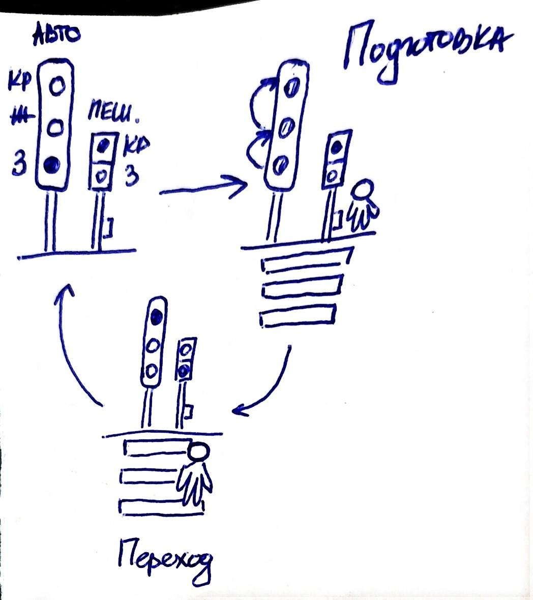

Нарисовав диаграмму машины состояний, это можно увидеть наглядно:

- «`Пешеходов нет`»: для автомобилей горит зеленый, для пешеходов – красный.
- «`Пешеход ждет`»: для автомобилей мигает зеленый, потом загорается желтый, для пешеходов – красный.
- «`Пешеходу можно идти`»: для автомобилей – красный, для пешеходов – зеленый.

Можно предложить следующую диаграмму машины состояний:

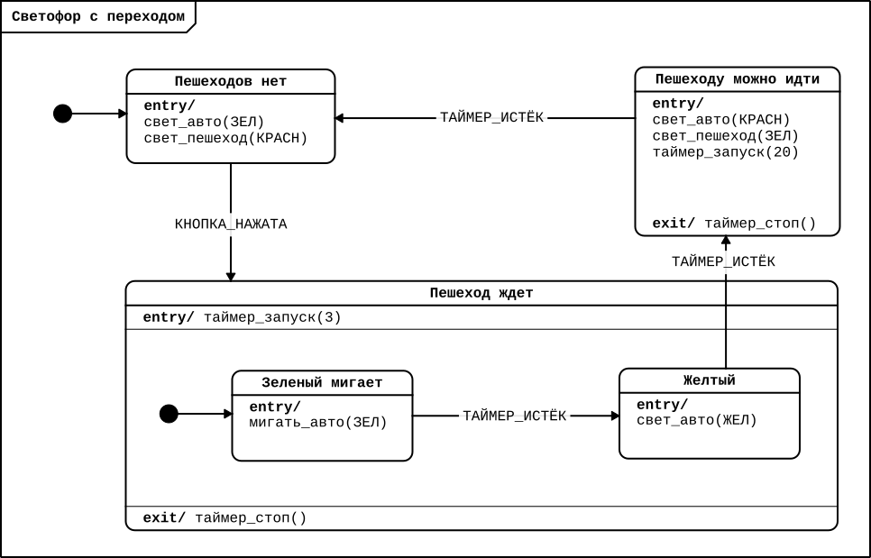

Обратите внимание, что в данной диаграмме реализована иерархия состояний. Когда кнопка
нажата подошедшим пешеходом, реализуется переход в состояние. Это состояние содержит еще
два — «`Зеленый мигает`» и «`Желтый`». В каждом из дочерних состояний программа находится
3 секунды, до срабатывания таймера. При выходе из состояния таймер останавливается. Также
в состоянии «`Переход ждет`» есть собственное обозначение начального состояния. Это нужно
для того, чтобы при входе в состояние было понятно, с какого дочернего состояния начинать
исполнение.

В предложенной простой логике пешеходного перехода светофор для автомобилей будет
переходить на «красный» при каждом нажатии кнопки. Обычно применяется более сложная логика
— специальная задержка, которая не дает снова включить переход для пешеходов. Допустим,
переход возможен только раз в две минуты. Попробуйте модифицировать схему, которая будет
реализовывать более сложную логику светофора.

Примером решения может быть следующая диаграмма:

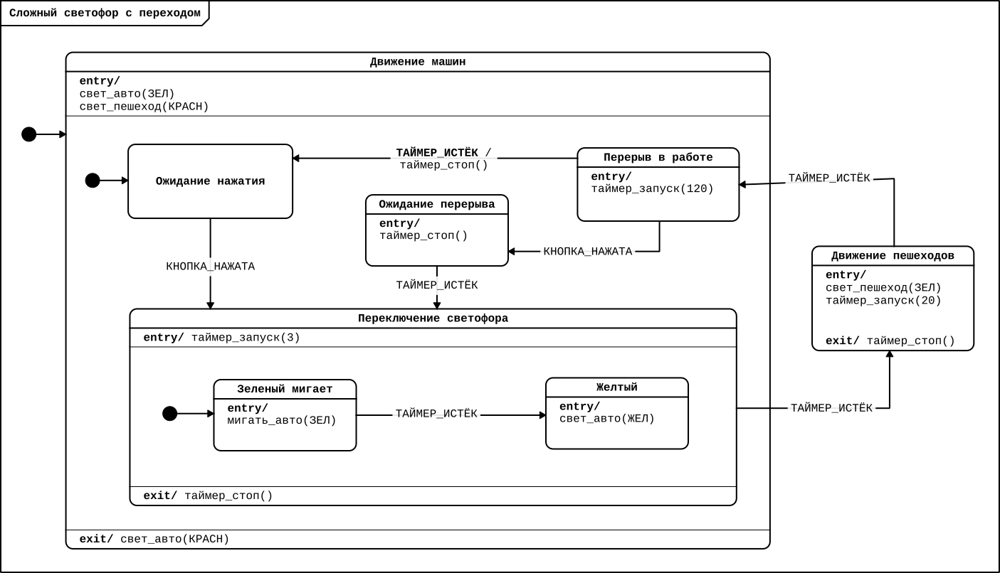

В практической можно будет попробовать собрать такую систему светофоров с помощью Arduino.

## Практическая часть

Для прохождения практической части вы можете использовать любой из доступных электронных
конструкторов, основанных на контроллере Arduino или воспользоваться самим контроллером и
простыми электронными компонентами. Также вы можете воспользоваться редактором Cyberiada
IDE для того, чтобы научиться работать с диаграммами, а онлайн-симуляторы Arduino можно
использовать для сборки электронных схем.

### 3.5. Сборка схемы

Задача для практической части:

> **Система светофоров на перекрестке (практика)**
>
> Напишите программу для системы на перекрестке, состоящей из автомобильного светофора и
> пешеходного светофора. Когда пешеходов нет, для машин всегда горит зеленый. Если пешеход
> нажал на кнопку, то его светофор зажигается зеленым, а машины должны остановиться.
>
> Затем соберите такую систему светофоров на базе микроконтроллера Arduino.

Реализуем простую схему светофора, обсужденную выше. Сперва соберем схему на макетной
плате. Для этого нам понадобится:

- микроконтроллер Arduino Uno;
- тактовая кнопка — 1 штука;
- резисторы около 220 Ом (180-300) — 5 штук;
- резистор около 10 кОм — 1 штука;
- светодиоды — 5 штук (2 красных, 1 желтый, 2 зеленых);
- макетная плата.

Схема подключения компонентов к контроллеру Arduino:

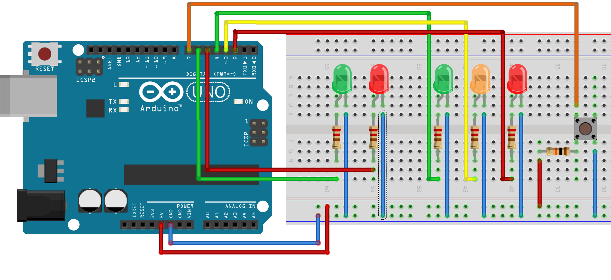

Электрическая схема подключения:

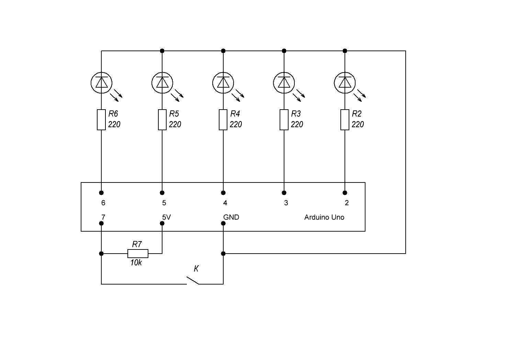

### 3.6. Перенос диаграммы в редактор «Cyberiada IDE»

Откройте редактор «Cyberiada IDE» и создайте новый файл на платформе «Arduino
Uno». Добавьте в программу необходимые компоненты:

- Таймер
- Красный светодиод (для авто)
- Красный светодиод (для пешехода)
- Желтый светодиод (для авто)
- Зеленый светодиод (для авто)
- Зеленый светодиод (для пешехода)
- Кнопка пешехода

Затем создайте следующую программу работы:

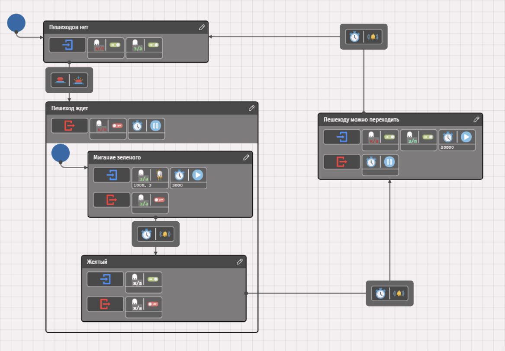

| **Состояние** | **Пояснение** |
|----|:---|
| «`Пешеходов нет`» | Для машин всегда горит зеленый, для пешеходов — красный (на входе зажигаем соответствующие светодиоды). Переход к следующему состоянию происходит по событию «`КнопкаПешехода.Клик`» |
| «`Пешеход ждет`» | Состоит из двух дочерних состояний: • «`Мигание зеленого`»: на входе мигание зеленым (автомобильным) светодиодом и запуск таймера на 3 секунды; на выходе выключаем диод. • «`Желтый`»: на входе включаем желтый (автомобильный) светодиод; на выходе выключаем. Переход к следующему состоянию происходит по событию «`Таймер.Тайм-аут`» (так как таймеры периодические — срабатывают раз в заданный промежуток, если не остановить). На выходе из состояния отключаем красный (пешеходный) светодиод и сбрасываем таймер. |
| «`Пешеходу можно переходить`» | Для машин горит красный, для пешеходов — зеленый. Дополнительно заводим таймер на 20 секунд. Переход к начальному состоянию по событию «`Таймер.Тайм-аут`» |

## Подведение итогов

На этом занятии вы ближе познакомились с двумя базовыми понятиями машин состояний и
событийного программирования — состояниями и событиями. Теперь вы можете конструировать
собственные машины состояний, управляющие самыми разными процессами, а также применять их
для программирования контроллеров.

Следующее, завершающее модуль занятие будет посвящено знакомству с другими возможностями
языка машин состояний и разбору реального проекта, использующего данную технологию для
программирования контроллеров.

## Дополнительные материалы

-  //
  Альманах киберфизики: Выпуск 1, 2024 год / Ред.: А. И. Федосеев, О. Е. Кускова — М.:
  Ассоциация участников технологических кружков, Национальная киберфизическая платформа,
  2025
- Воеводин, И.Г., Воеводина, А.И., Цырульников, Е.С., Шумак, К.А. . М.:
  Ассоциация участников технологических кружков, 2024
